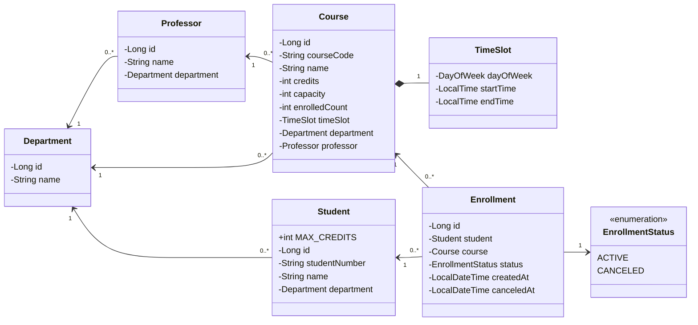

# 도메인 모델 다이어그램

현재 코드베이스(`src/main/java/.../domain`) 기준, 메서드를 제외하고 속성만 반영한 Mermaid 다이어그램입니다.

```mermaid
classDiagram
direction LR

class Department {
  -Long id
  -String name
}

class Professor {
  -Long id
  -String name
  -Department department
}

class Student {
  +int MAX_CREDITS
  -Long id
  -String studentNumber
  -String name
  -Department department
}

class TimeSlot {
  -DayOfWeek dayOfWeek
  -LocalTime startTime
  -LocalTime endTime
}

class Course {
  -Long id
  -String courseCode
  -String name
  -int credits
  -int capacity
  -int enrolledCount
  -TimeSlot timeSlot
  -Department department
  -Professor professor
}

class Enrollment {
  -Long id
  -Student student
  -Course course
  -EnrollmentStatus status
  -LocalDateTime createdAt
  -LocalDateTime canceledAt
}

class EnrollmentStatus {
  <<enumeration>>
  ACTIVE
  CANCELED
}


Department "1" <-- "0..*" Student
Department "1" <-- "0..*" Professor
Department "1" <-- "0..*" Course
Professor "1" <-- "0..*" Course
Course *-- "1" TimeSlot

Student "1" <-- "0..*" Enrollment
Course "1" <-- "0..*" Enrollment
Enrollment --> "1" EnrollmentStatus
```
